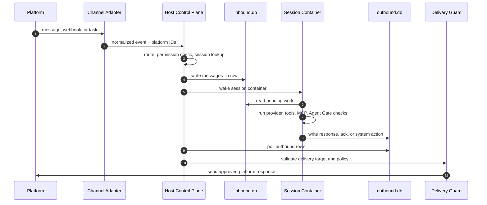

<p align="center">
  
</p>

<p align="center">
  AI agent containment runtime: scan, isolate, run, and quarantine autonomous agents with real workspace and runtime boundaries.
</p>

<p align="center">
  <a href="https://github.com/aviatam/area51/actions/workflows/test-matrix.yml">
    
  </a>
</p>

---

## What Area51 Is

Area51 is a security-first runtime for personal and team AI agents. It keeps the lightweight agent-group model, memory, messaging routes, scheduled jobs, and per-agent workspaces, then adds a stronger containment story around runtime isolation and release gates.

The first demo path combines:

- **Agent groups** with their own instructions, memory, skills, packages, and MCP servers
- **Agent Gate** scans for AI secret setup, package risk, behavior scenarios, integration health, and five-pillar readiness
- **Incus runtime planning** for per-agent projects, profiles, instances, mounts, quotas, snapshots, and quarantine flows
- **Fail-closed reports** for demos and CI

## Why We Know It Works

Area51 is not treated as "working" because it starts once on one laptop. The current `main` branch is gated by a cross-OS workflow that installs from the lockfile, blocks known high-severity dependency advisories, typechecks the host, and runs behavior tests.

Current verified baseline:

- Latest verified commit: `575737336760c3a395d726fccf624aa1e0c12990`
- GitHub run: [Cross-OS Tests #31875321582](https://github.com/aviatam/area51/actions/runs/31875321582)
- Ubuntu: full host behavior test suite passes
- macOS: full host behavior test suite passes
- Windows: blocking portable host behavior suite passes
- Local Windows-equivalent portable suite: 175 tests passed
- Local `pnpm audit --audit-level high`: passes, with only one low-severity advisory remaining
- Legacy-brand scan: clean outside ignored dependency/build/git directories

The Windows lane is intentionally honest: it is blocking, but it runs the portable host suite rather than the full POSIX-heavy corpus. The full corpus still contains tests that require Unix symlink privileges, executable-bit semantics, and Bash. Those are tracked as portability work, not hidden behind `continue-on-error`.

## Architecture

<p align="center">
  
</p>

Area51 has five main layers:

1. **Host process**

   The host owns channels, routing, scheduling, permissions, delivery, and container lifecycle. It receives platform events, decides which agent group should handle them, writes work into the session inbox, wakes the agent container, and later delivers approved output back to the platform.

2. **Agent groups**

   An agent group is the durable identity of an agent: instructions, memory, skills, MCP servers, package state, and container configuration. Multiple conversations can use the same agent group, but each conversation gets its own session boundary.

3. **Per-session database boundary**

   Each active session has two SQLite files:

   - `inbound.db`: written by the host and mounted read-only into the container
   - `outbound.db`: written by the container agent runner and read by the host

   This split keeps a single writer per database file and makes host/container communication explicit. Messages, scheduled tasks, processing acknowledgements, system actions, and delivery requests all cross this boundary as structured rows instead of ad hoc files or shell pipes.

4. **Container runner**

   The container runner starts a scoped runtime for each session. It mounts only the intended workspace, session databases, skills, and approved extra paths. Runtime commands are passed as argv arrays rather than shell strings where safety matters, so container names and labels cannot become shell injection primitives.

5. **Agent Gate and quarantine planning**

   Agent Gate scores a group across capabilities, evolution, skill efficiency, integration, and security. It detects missing secrets, missing policy surfaces, invalid MCP wiring, risky package versions, and scenario coverage gaps. When risk is found, Area51 produces fail-closed reports and an Incus quarantine plan: freeze/stop, snapshot, isolate networking, label evidence, and preserve artifacts.

### Message Flow



The design goal is simple: the agent can ask and act inside its scoped runtime, but the host owns identity, routing, permissions, credentials, delivery, and quarantine.

## Quick Start

```bash
git clone https://github.com/aviatam/area51.git area51
cd area51
bash area51.sh
```

Run the working containment demo:

```bash
area51 demo --output-dir .area51/demo
```

The demo creates a support-refund agent, checks AI secret configuration, scores every pillar, detects a compromised package, writes quarantine evidence, and produces the Incus freeze/snapshot/network-isolation plan.

## Demo Output

```text
.area51/demo/reports/agent-gate.json
.area51/demo/reports/incus-runtime-plan.json
.area51/demo/reports/area51-demo.json
```

Expected result:

```text
Area51 demo: VERIFIED
fail-closed gate: yes
quarantine artifacts: yes
Incus quarantine flow: yes
```

## Core Commands

```bash
area51 demo --output-dir .area51/demo
area51 agent-gate scan --path ./groups/support-agent
area51 agent-gate scan --path ./groups/support-agent --json-path reports/agent-gate.json --ci
```

## Five Pillars

- **Capabilities**: agent files, skills, and concrete behavior scenario coverage
- **Evolution**: memory and regression surfaces that let agents improve safely
- **Skill efficiency**: package footprint and dependency risk
- **Integration**: MCP and channel wiring health
- **Security**: AI secrets, policy files, runtime isolation, and quarantine evidence

## Runtime Direction

Docker remains useful for local compatibility. Incus is the stronger Area51 runtime target for Linux deployments because it gives project-level isolation, reusable profiles, resource limits, snapshots, freeze/stop controls, and VM escalation for high-risk agents.

Area51 currently generates the Incus execution plan in the demo. A live Linux runtime adapter can apply the same commands through the Incus CLI or REST API.

## Requirements

- macOS or Linux, with Windows via WSL2
- Node.js 20+ and pnpm 10+
- Docker for the default local runtime
- Incus on Linux for live Area51 isolation work

## Documentation

- [Area51 demo](docs/area51.md)
- [Agent Gate](docs/agent-gate.md)
- [Commercial licensing review](docs/commercial-licensing-review.md)
- [Architecture](docs/architecture.md)
- [Security](docs/SECURITY.md)

## License

MIT. See [LICENSE](LICENSE).
