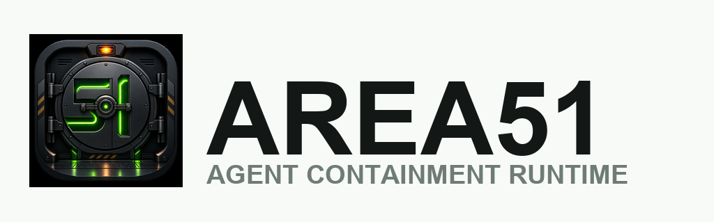
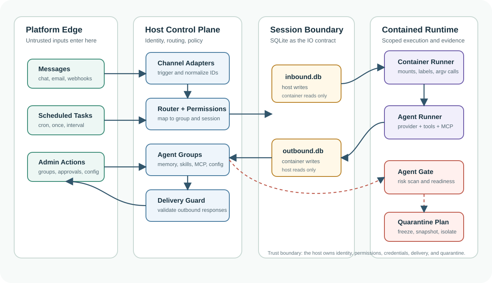
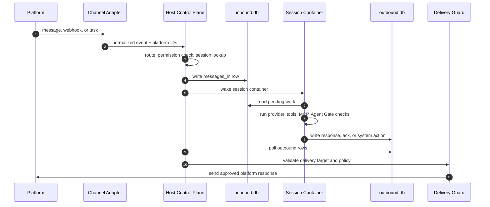

<p align="center">
  
</p>

<p align="center">
  AI agent containment runtime: scan, isolate, run, and quarantine autonomous agents with real workspace and runtime boundaries.
</p>

<p align="center">
  <a href="https://github.com/aviatam/area51/actions/workflows/test-matrix.yml">
    
  </a>
</p>

---

## What Area51 Is

Area51 is a security-first runtime for personal and team AI agents. It keeps the lightweight agent-group model, memory, messaging routes, scheduled jobs, and per-agent workspaces, then adds a stronger containment story around runtime isolation and release gates.

The first demo path combines:

- **Agent groups** with their own instructions, memory, skills, packages, and MCP servers
- **Agent Gate** scans for AI secret setup, package risk, behavior scenarios, integration health, and five-pillar readiness
- **Runtime Policy** turns Agent Gate findings, admin posture, trust level, data sensitivity, and requested capabilities into a host-owned runtime decision
- **Incus runtime planning** for per-agent projects, profiles, instances, mounts, quotas, snapshots, and quarantine flows
- **Exposure reports** that connect an agent, repo, or code-change workspace to one assessment surface
- **Fail-closed reports** for demos and CI

## Why We Know It Works

Area51 is not treated as "working" because it starts once on one laptop. The current `main` branch is gated by a cross-OS workflow that installs from the lockfile, blocks known high-severity dependency advisories, typechecks the host, and runs behavior tests.

Current verified baseline is the latest `main` run linked by the badge above. The workflow verifies:

- Ubuntu: full host behavior test suite passes
- macOS: full host behavior test suite passes
- Windows: blocking portable host behavior suite passes
- Local Windows-equivalent portable suite: 175 tests passed
- Local `pnpm audit`: passes with no known vulnerabilities
- Legacy-brand scan: clean outside ignored dependency/build/git directories

The Windows lane is intentionally honest: it is blocking, but it runs the portable host suite rather than the full POSIX-heavy corpus. The full corpus still contains tests that require Unix symlink privileges, executable-bit semantics, and Bash. Those are tracked as portability work, not hidden behind `continue-on-error`.

## Architecture

<p align="center">
  
</p>

Area51 has five main layers:

1. **Host process**

   The host owns channels, routing, scheduling, permissions, delivery, and container lifecycle. It receives platform events, decides which agent group should handle them, writes work into the session inbox, wakes the agent container, and later delivers approved output back to the platform.

2. **Agent groups**

   An agent group is the durable identity of an agent: instructions, memory, skills, MCP servers, package state, and container configuration. Multiple conversations can use the same agent group, but each conversation gets its own session boundary.

3. **Per-session database boundary**

   Each active session has two SQLite files:

   - `inbound.db`: written by the host and mounted read-only into the container
   - `outbound.db`: written by the container agent runner and read by the host

   This split keeps a single writer per database file and makes host/container communication explicit. Messages, scheduled tasks, processing acknowledgements, system actions, and delivery requests all cross this boundary as structured rows instead of ad hoc files or shell pipes.

4. **Container runner**

   The container runner starts a scoped runtime for each session. It mounts only the intended workspace, session databases, skills, and approved extra paths. Runtime commands are passed as argv arrays rather than shell strings where safety matters, so container names and labels cannot become shell injection primitives.

5. **Agent Gate, Runtime Policy, and quarantine planning**

   Agent Gate scores a group across capabilities, evolution, skill efficiency, integration, and security. Runtime Policy then converts those findings plus admin profile, trust level, data sensitivity, and requested capabilities into a host-owned decision: local Docker compatibility, Incus container, Incus VM, quarantine, or block. When risk is found, Area51 produces fail-closed reports and an Incus quarantine plan: freeze/stop, snapshot, isolate networking, label evidence, and preserve artifacts.

### Message Flow



The design goal is simple: the agent can ask and act inside its scoped runtime, but the host owns identity, routing, permissions, credentials, delivery, and quarantine.

## Quick Start

### One-command governed Linux installation

Supported first-party targets: Ubuntu 22.04/24.04 and Debian 12/13 on amd64 or arm64 with KVM and at least 4 GB RAM.

Preview without changing the host:

```bash
curl -fsSL https://raw.githubusercontent.com/aviatam/area51/main/install-linux.sh | bash -s -- --plan
```

Install system prerequisites, Incus, Area51, both runtime images, governance, and the production service:

```bash
curl -fsSL https://raw.githubusercontent.com/aviatam/area51/main/install-linux.sh | bash
```

The command requires a regular user with `sudo` and retains interactive provider/channel authentication. It fails before installation when KVM or the supported host contract is unavailable.

### One-command macOS installation

Preview without changing the Mac:

```bash
curl -fsSL https://raw.githubusercontent.com/aviatam/area51/main/install-macos.sh | bash -s -- --plan
```

Install Homebrew and Apple Command Line Tools when needed, then install Area51,
Docker Desktop, and its `launchd` service:

```bash
curl -fsSL https://raw.githubusercontent.com/aviatam/area51/main/install-macos.sh | bash
```

The macOS path uses Docker and retains interactive provider/channel
authentication. Incus VM escalation remains a Linux-only production tier.

### One-command Windows installation through WSL2

From an Administrator PowerShell window, preview without changing the machine:

```powershell
& ([scriptblock]::Create((irm 'https://raw.githubusercontent.com/aviatam/area51/main/install-windows.ps1'))) -Plan
```

Install WSL2, Ubuntu, Docker, Area51, and its Linux service:

```powershell
& ([scriptblock]::Create((irm 'https://raw.githubusercontent.com/aviatam/area51/main/install-windows.ps1')))
```

If Windows has not initialized WSL before, the command stops for the required
Windows restart and first Linux-user creation. Run the same command again to
resume. Windows uses Docker inside WSL2; Incus VM escalation remains a
Linux-host production tier.

### Repository installation

```bash
git clone https://github.com/aviatam/area51.git area51
cd area51
bash area51.sh
```

Run the working containment demo:

```bash
area51 demo --output-dir .area51/demo
```

To demonstrate a clean agent changing into a quarantined Incus VM workload, run the
[`/governed-escalation-demo`](docs/governed-escalation-demo.md) utility skill. It
produces machine-readable assertions locally and delegates authoritative live proof
to the existing hosted-KVM E2E.

The demo creates a support-refund agent, checks AI secret configuration, scores every pillar, detects a compromised package, writes quarantine evidence, and produces the Incus freeze/snapshot/network-isolation plan.

## Demo Output

```text
.area51/demo/reports/agent-gate.json
.area51/demo/reports/runtime-policy.json
.area51/demo/reports/incus-runtime-plan.json
.area51/demo/reports/area51-demo.json
```

Expected result:

```text
Area51 demo: VERIFIED
fail-closed gate: yes
runtime policy fail-closed: yes
quarantine artifacts: yes
Incus quarantine flow: yes
```

## Core Commands

```bash
area51 demo --output-dir .area51/demo
area51 expose --path ./groups/support-agent --target-type agent --json-path reports/exposure.json
area51 expose --path . --target-type change --verify-script verify --json-path reports/exposure.json
area51 agent-gate scan --path ./groups/support-agent
area51 agent-gate scan --path ./groups/support-agent --json-path reports/agent-gate.json --ci
```

`area51 expose` is the broad entry point for connecting Area51 to work you want to assess. It accepts an agent group, a repository, or a code-change workspace and returns one report with:

- Agent Gate findings when the target contains an agent definition
- package verification status using a named package script, not arbitrary shell text
- Runtime Policy decision when an agent gate exists
- vendor-readiness metadata when the target declares `.area51/agent-target.json`
- normalized findings with severity, evidence, recommendation, and next steps
- optional JSON output for CI, dashboards, or release evidence

Examples:

```bash
# Inspect an agent before running it in production posture.
area51 expose \
  --path ./groups/support-agent \
  --target-type agent \
  --runtime-profile production \
  --data-sensitivity customer \
  --capabilities chat,network,package-install \
  --json-path reports/support-agent-exposure.json

# Inspect the current repo/change and run the normal verify script.
area51 expose \
  --path . \
  --target-type change \
  --verify-script verify \
  --json-path reports/change-exposure.json
```

## Verification Commands

```bash
pnpm run audit:high
pnpm run typecheck
pnpm run test:portable:windows
pnpm run verify
```

`pnpm run verify` matches the fast local confidence path: high-severity dependency audit, host typecheck, and the portable behavior suite that also runs as the blocking Windows CI lane. Linux and macOS CI run the full host behavior suite.

## Vendor Coverage

Area51 separates assessment from live execution:

- **Assessment** works for vendor-neutral agent targets. `area51 expose` reads
  `AGENTS.md`, `security-policy.md`, `.area51/agent-gate/scenarios/*.json`,
  `container.json`, and optional `.area51/agent-target.json`.
- **Behavior execution across vendors** is delegated to Agent Gym when the
  target was generated from an Agent Gym suite. Agent Gym can drive HTTP/REST,
  Python script, or custom plugin adapters for OpenAI, Claude, Gemini, Ollama,
  LangGraph, CrewAI, AutoGen, hosted agents, and in-house agents.
- **Native Area51 live runtime** is only for providers implemented inside the
  Area51 runner. Today Claude is the native production provider; other vendors
  should be reported as `external-adapter` until an Area51 provider module is
  added for them.

When an Agent Gym target includes `.area51/agent-target.json`, exposure reports
include:

```json
{
  "vendor_support": {
    "vendor": "openai",
    "model": "gpt-5-codex",
    "adapter": "http",
    "agentgym_behavior_execution": true,
    "area51_native_runtime": false,
    "status": "external-adapter"
  }
}
```

That means the vendor can be tested through Agent Gym, while Area51 contributes
gate checks, runtime policy, quarantine posture, and release evidence. Add a
native Area51 provider only when Area51 itself must run that vendor live inside
its managed runtime.

## Five Pillars

- **Capabilities**: agent files, skills, and concrete behavior scenario coverage
- **Evolution**: memory and regression surfaces that let agents improve safely
- **Skill efficiency**: package footprint and dependency risk
- **Integration**: MCP and channel wiring health
- **Security**: AI secrets, policy files, runtime isolation, and quarantine evidence

## Runtime Direction

Docker remains useful for local compatibility. Incus is the stronger Area51 runtime target for Linux deployments because it gives project-level isolation, reusable profiles, resource limits, snapshots, freeze/stop controls, and VM escalation for high-risk agents.

Runtime Policy is host-owned: the agent cannot select its own isolation level or mount the Incus socket. Local mode can stay on Docker for trusted low-risk work. Production mode prefers Incus containers. Maximum mode can run in Incus VMs through managed storage volumes and a dedicated OneCLI-only bridge with default-reject ingress and egress. Unsupported VM mount shapes fail closed. Compromised-package evidence on the live Incus path freezes and snapshots the instance, stops it, detaches normal networking, and preserves the evidence before provider execution.

Every live wake now runs Agent Gate before creating Docker or Incus resources. The configured backend and instance kind define the host's posture and Incus availability; Runtime Policy combines that posture with the gate report and stored package/mount capabilities, then names the only runtime Area51 may launch. Risky local work blocks instead of silently falling back to Docker, production work can escalate from an Incus container to a VM, and quarantine evidence is frozen and snapshotted before provider execution. Each decision is written with mode `0600` under `data/runtime-policy/<session-id>.json`, outside all agent mounts.

Area51 keeps Docker as the default local runtime. Packaged installs can pull one
multi-arch OCI agent image and run those same bytes under Docker or, on Linux
hosts with Incus OCI support, under Incus containers.

For Docker installs, the image is controlled by the committed `agent-image` pin
in `versions.json` or by `AREA51_AGENT_IMAGE_REF`:

```bash
AREA51_HARDENED_IMAGE=true
AREA51_AGENT_IMAGE_REF=ghcr.io/aviatam/area51-agent@sha256:<digest>
```

For Incus installs, configure an OCI remote that points at the registry and use
the same image path/digest through that remote, or build the local system image
with `bash container/incus/build.sh`:

```bash
AREA51_RUNTIME_BACKEND=incus
AREA51_INCUS_IMAGE=area51-ghcr:aviatam/area51-agent@sha256:<digest>
AREA51_INCUS_INSTANCE_KIND=container
```

For the maximum-isolation VM path, build the VM image and expose the host-side
OneCLI relay only on the private bridge address:

```bash
AREA51_RUNTIME_BACKEND=incus
AREA51_INCUS_INSTANCE_KIND=vm
AREA51_INCUS_IMAGE=local:area51-agent-v2-vm
AREA51_INCUS_STORAGE_POOL=default
AREA51_INCUS_VM_NETWORK=area51vm0
AREA51_INCUS_VM_ACL=area51-vm-onecli
AREA51_INCUS_VM_IPV4_CIDR=10.251.0.1/24
AREA51_INCUS_VM_ONECLI_ADDRESS=10.251.0.1
AREA51_INCUS_VM_ONECLI_PORT=10255
```

When `AREA51_RUNTIME_BACKEND=incus`, Incus is available to live Runtime Policy. A normal production decision uses an Incus container; a sufficiently risky decision or maximum posture uses a VM. Area51 builds the host-owned mount set, hardens it for the selected Incus kind, creates/applies the plan, then runs the agent runner with `incus exec`. The Incus socket is never mounted into the agent instance. The backend uses argv-based CLI calls, not shell-interpolated command strings.

The Incus mount policy is intentionally stricter than the Docker local path: only the session workspace and Claude's exact `/home/node/.claude` provider-state path may remain writable. Agent definitions, runner source, skills, other provider paths, and plugin content are read-only, and the Incus adapter refuses dangerous host sources such as filesystem roots, home-directory roots, SSH/cloud config directories, Docker/Podman sockets, and Incus/LXD sockets before invoking Incus. In VM mode the writable paths are isolated managed volumes, never live host bind mounts.

The Incus backend is Linux-production oriented. Docker remains the recommended local/dev path and the fallback for users who do not want to install Incus. VM execution uses the separate `local:area51-agent-v2-vm` image by default. The host-side OneCLI relay must listen on the configured private bridge address (default `10.251.0.1:10255`); the VM receives no general internet route, and startup fails if its mounts cannot be represented without weakening the managed-disk boundary.

Normal Incus exits delete the per-session instance and managed VM volumes. Each runtime is stamped with an installation identifier so startup can reap only that installation's crash orphans. Quarantined instances and their volumes are intentionally preserved for evidence and require an explicit operator decision before removal.

VM managed volumes are intentionally treated as copy-based transport, not as live host mounts. Area51 periodically imports the host-owned inbound database into the guest and atomically exports a consistent guest-owned outbound snapshot. Before controlled VM deletion it also exports bounded, regular-file-only Claude state through a root-owned staging area, validates every path, size, and SHA-256 digest, and atomically replaces the host copy. The hosted KVM gate verifies a cold message, a warm follow-up, real Claude hook registration, and provider-state survival across VM replacement before VM runtime changes can merge.

## Requirements

- macOS or Linux, with Windows via WSL2
- Node.js 20+ and pnpm 10+
- Docker for the default local runtime
- Incus on Linux for live Area51 isolation work

## Documentation

- [Area51 demo](docs/area51.md)
- [Agent Gate](docs/agent-gate.md)
- [Commercial licensing review](docs/commercial-licensing-review.md)
- [Architecture](docs/architecture.md)
- [Security](docs/SECURITY.md)

## License

MIT. See [LICENSE](LICENSE).
