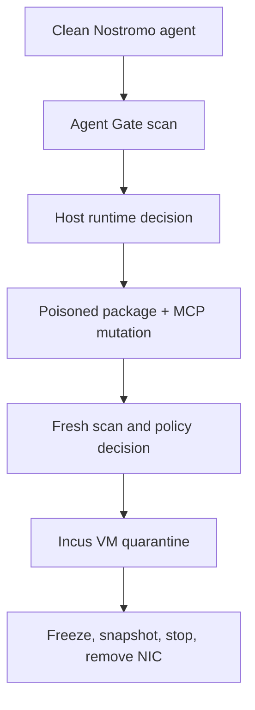

# Governed escalation demo

This demo answers the operational question Area51 is built for: **what happens when an agent that was acceptable yesterday changes into a workload the host no longer trusts?**

## One-command local proof

After the normal Area51 installation, run `/governed-escalation-demo`, or run its deterministic driver directly:

```bash
pnpm exec tsx .claude/skills/governed-escalation-demo/scripts/run.ts \
  --output-dir .area51/governed-demo
```

The output is deliberately split into deterministic contract evidence and authoritative live evidence. The local command never labels a planned Incus command as executed.



## What to show in a product demo

1. Open `reports/01-clean-gate.json` and `reports/01-clean-policy.json`. The agent has a support policy, an adversarial-ticket scenario, and a clean package set.
2. Open the generated mutated fixture. It adds `event-stream@3.3.6` and an unknown `predators` MCP server.
3. Open `reports/02-poisoned-gate.json`. The fresh scan detects the compromised package from the current configuration.
4. Open `reports/02-poisoned-policy.json`. Maximum host posture requires `incus-vm` and quarantine; the agent cannot request a Docker fallback.
5. Open `reports/03-incus-vm-quarantine-plan.json`. It records the freeze, snapshot, stop, NIC-removal, and quarantine-marker contract.
6. Open `reports/assertions.json`. Every claim used in the demo has a machine-readable pass/fail result.

## Live proof

The repository's **Incus VM Image Smoke** workflow is the authoritative proof. On a disposable KVM-capable Linux runner it builds the VM-native image, applies live Runtime Policy, executes the production Incus adapter, mutates the security posture, and verifies:

- the quarantined runtime is a stopped VM;
- an evidence snapshot exists;
- the quarantine reason and profile marker remain attached;
- the normal managed NIC is gone;
- guest execution is rejected after containment.

Use `--live` only in that prepared environment:

```bash
pnpm exec tsx .claude/skills/governed-escalation-demo/scripts/run.ts --live
```

## Why this is different from NanoClaw

This is not a universal superiority claim. A small personal Docker assistant can be the better choice when minimal installation and direct owner customization are the main goals. Area51's selling point begins when a platform or security owner needs all four properties together:

| Requirement               | Area51 proof                                                                   |
| ------------------------- | ------------------------------------------------------------------------------ |
| Reevaluate after mutation | Clean and poisoned configurations receive separate fresh decisions             |
| Host owns the boundary    | Runtime selection is policy output, not an agent choice                        |
| No weaker fallback        | Maximum/risky posture requires Incus VM or blocks                              |
| Incident evidence         | Quarantine retains a snapshot, markers, and a stopped network-isolated runtime |

The concise story is: **NanoClaw makes a personal agent small enough to understand; Area51 makes a changing agent governable enough to operate.**

## OWASP claim discipline

The Nostromo fixture demonstrates supply-chain/provenance mutation, tool/MCP expansion, prompt-driven goal hijacking, excessive capability pressure, and containment evidence. It must not be advertised as preventing every OWASP Agentic Top 10 category. Publish each scenario separately as **prevented**, **contained**, **detected**, or **not yet covered**, backed by an assertion and CI log.
